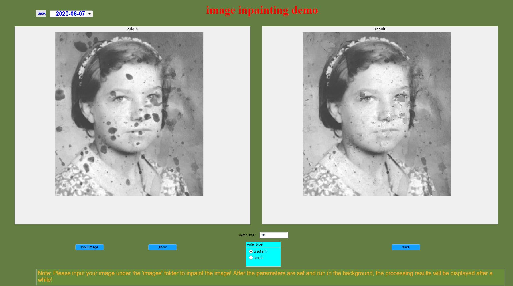

<h1 align="center"> Simple Image-Inpainting GUI-Demo</h1>

<br>
<br>
<br>

# How to repair your own image?
**1, Create your image mask**<br>
Put your image in ```yourImgFolder``` folder, execute ```createImgMask.m``` to get the mask image.<br>
**2,Just run the simple gui**<br>


